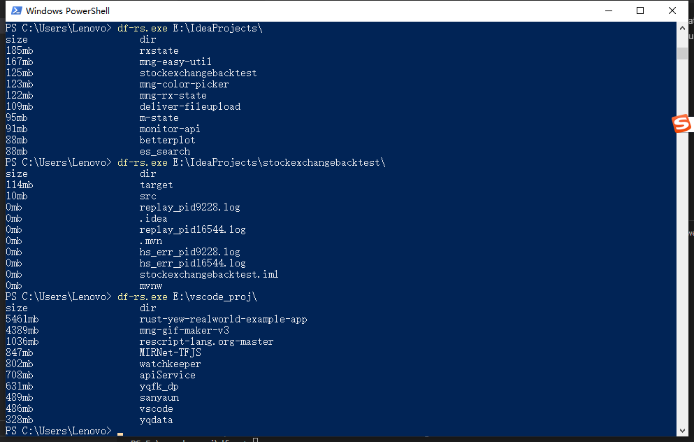
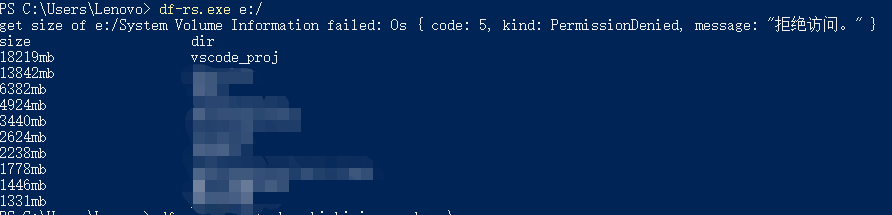

This project makes a command line tool that can list the 10 biggest size of the directoy for the path you support. I am a beginner of rust, the tool may has performant problem, it takes almost 5 minutes to scan my `e:/` path on my Windows10 computer with 79GB size of `e` hard disk. Probably because the `e` disk contains a lot of frontend projects which contain a huge number of files in node_modules directory that slow the scanning speed.

Caution: The tool was only used and tested on Windows. If you have any problems on other system or have some good advices about speeding scanning performance, please let me know.

### example

### install 

`
cargo install df-rs
`

### useage

`
df-rs e:/
`

